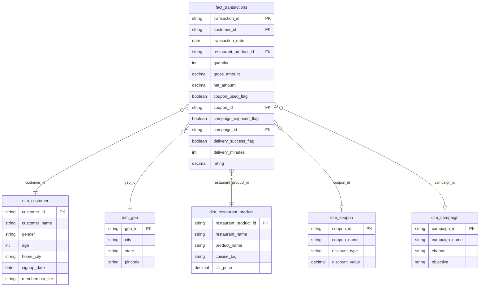

# Swiggy SQL Analytics

Advanced SQL practice project built on a synthetic Swiggy-style food-delivery
star schema — 1 fact table (~158K transactions) and 5 dimension tables.
10 business questions covering multi-table JOINs, window functions, CTEs,
and data-quality checks, each with a hint, a solution query, and the
resulting business insight.

## Schema (star schema)



## Repo structure

```
swiggy-sql-analytics/
├── data/                       # source CSVs (converted from the raw xlsx extracts)
│   ├── fact_transactions.csv   # ~158,400 rows
│   ├── dim_customer.csv        # ~6,000 rows
│   ├── dim_geo.csv
│   ├── dim_restaurant_product.csv
│   ├── dim_coupon.csv
│   └── dim_campaign.csv
├── sql/
│   ├── 01_schema.sql           # CREATE TABLE + indexes
│   ├── 02_practice_questions.sql  # 10 prompts, no answers
│   └── 03_solutions.sql        # 10 solved queries + insights
└── README.md
```

## Business analytics case studies

| # | Business question | Concepts |
|---|---|---|
| 1 | How do we build one unified order view enriched with customer, location, product, coupon, and campaign context? | 5-way multi-table LEFT JOIN |
| 2 | Can we trust the revenue numbers, or are there transactions pointing to customers/products/coupons/campaigns that don't exist? | LEFT JOIN + UNION ALL |
| 3 | Which cuisines should we prioritize for city-specific promotions, month over month? | CTE + `ROW_NUMBER()` window function |
| 4 | Which restaurants are driving the most revenue per city over the last year, and are any of them also slow on delivery? | JOIN + date filtering |
| 5 | Which coupons are actually worth running, based on burn vs. the order value they generate? | JOIN + aggregation |
| 6 | Which marketing campaigns deliver the best click-through and revenue per rupee of discount spent? | CTE + LEFT JOIN + `NULLIF` |
| 7 | Which pincodes are our highest-value delivery zones, and where is delivery reliability weakest? | JOIN + aggregation |
| 8 | Which customer segments (city, gender, age) should we prioritize for retention or upsell campaigns? | CTE + `CASE WHEN` banding |
| 9 | Which products actually drive revenue by city, to guide restaurant-partner negotiations? | JOIN + `SUM` vs `COUNT` |
| 10 | Are customers being charged consistent with catalog prices, or is there billing leakage? | JOIN + divide-by-zero handling |

Each row mirrors a real ask from marketing, ops, or finance rather than
an abstract query exercise. The runnable SQL for all 10 is in
`sql/03_solutions.sql`; the full walkthrough — approach, findings, and
the business recommendation each one supports — is in
**[docs/ANALYTICS_CASE_STUDY.md](docs/ANALYTICS_CASE_STUDY.md)**.

## Key insights surfaced

- **Cuisine trends**: Andhra cuisine topped Bangalore's December revenue at ₹33,408 across 119 orders.
- **Best-performing campaign**: `EMAIL_303` ("Weekend Special") had a 22.26% CTR and the best revenue-per-coupon-burn ratio (₹23.74).
- **Highest-value delivery zone**: pincode 560103 (Bangalore, Karnataka) — 7,960 orders, ₹18.3L revenue.
- **Top customer segment**: Bangalore males aged 25-34 drove ₹39.2L net revenue at a ₹225 average order value.
- **Data quality**: zero orphan fact rows across all 5 dimensions and zero price-realization discrepancies — confirms the dataset is internally consistent.

## How to run

1. Load the CSVs in `data/` into a database (PostgreSQL, MySQL, SQLite,
   or a Databricks/Spark SQL workspace all work with minor syntax tweaks).
2. Run `sql/01_schema.sql` to create the tables, then load each CSV into
   its matching table.
3. Try the prompts in `sql/02_practice_questions.sql` yourself, then
   check against `sql/03_solutions.sql`.

> Note: the solutions were originally developed and run against a
> Databricks SQL workspace (`workspace.swiggy.<table>`); table
> references here are simplified to match `01_schema.sql`. Swap in
> `date_sub`/`date_format` equivalents (`CURRENT_DATE - INTERVAL '365 days'`,
> `TO_CHAR(...)`, etc.) if running on Postgres/MySQL.

## Tech

SQL (window functions, CTEs, multi-table joins, data quality checks) ·
star schema data modeling · synthetic food-delivery transactional data

